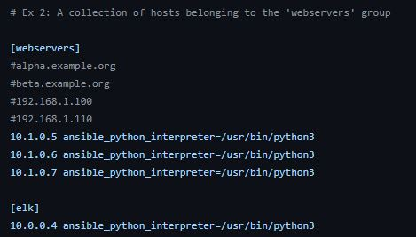

# ELK-Stack-Project
Azure Cloud ELK stack deployment

## Automated ELK Stack Deployment
The files in this repository were used to configure the network depicted 
below.

![TODO: Update the path with the name of your diagram]
(Images/diagram_filename.png)

These files have been tested and used to generate a live ELK deployment on
Azure. They can be used to either recreate the entire deployment pictured 
above. Alternatively, select portions of the **_YAML_** file may be used to
install only certain pieces of it, such as Filebeat.

This document contains the following details:
- Description of the Topology
- Access Policies
- ELK Configuration
 - Beats in Use
 - Machines Being Monitored
- How to Use the Ansible Build

### Description of the Topology
The main purpose of this network is to expose a load-balanced and 
monitored instance of DVWA, the D*mn Vulnerable Web Application.
Load balancing ensures that the application will be highly **_EFFECTIVE_**, 
in addition to restricting **_ACCESS_** to the network.

What aspect of security do load balancers protect? 
- **_THEY PREVENT UNWANTED OR UNAUTHORIZED TRAFFIC FROM REACHING THE APPLICATION._**

What is the advantage of a jump box? 
- **_THEY ADD A SECURITY LAYER TOT HE WEB SERVERS PREVENTING THEM FROM BEING EXPOSED TO THE PUBLIC._**

Integrating an ELK server allows users to easily monitor the vulnerable 
VMs for changes to the **_CONFIGURATION FILES_** and system **_FILES._**

What does Filebeat watch for? 
- **_THEY WATCH FOR LOG FILES OR LOG EVENTS._**

What does Metricbeat record? 
- **_THEY RECORD METRICS FROM ON GOING SERVICES ON THE SERVER._**

The configuration details of each machine may be found below.
_Note: Use the [Markdown Table Generator

(http://www.tablesgenerator.com/markdown_tables) to add/remove values from
the table_.
| Name | Function | IP Address | Operating System |
|----------|----------|------------|------------------|
| Jump-Box-Provisioner | Gateway | 10.1.0.4 | Linux |
| Web-1 | Webserver| 10.1.0.5 | Linux |
| Web-2 | Webserver| 10.1.0.6 | Linux |
| Web-3 | Webserver| 10.1.0.7 | Linux |
| ELK-Server | Webserver| 10.0.0.4 | Linux |

### Access Policies
The machines on the internal network are not exposed to the public 
Internet. 
Only the **_Jump-Box-Provisioner-** machine can accept connections from the
Internet. Access to this machine is only allowed from the following IP 
addresses:
- **_111.111.86.222_**

Machines within the network can only be accessed by **_Jump-Box-Provisioner._**
Which machine did you allow to access your ELK VM? **_My personal 
computer_**
What was its IP address? **_111.111.86.222_**

A summary of the access policies in place can be found in the table below.

| Name | Publicly Accessible | Allowed IP Addresses |
|----------|---------------------|----------------------|
| Jump-Box-Provisioner | Yes (SSH) | 111.111.86.222 |
| Web-1 | No | 111.111.86.222 | 
| Web-2 | No | 111.111.86.222 | 
| Web-3 | No | 111.111.86.222 | 
| ELK-Server | Yes (http) | 111.111.86.222 | 

### Elk Configuration 
Ansible was used to automate configuration of the ELK machine. No 
configuration was performed manually, which is advantageous because...

- What is the main advantage of automating configuration with 
Ansible?
- **_It is flexible because it allows changes to be made within any 
of the VMs associated with it._**

The playbook implements the following tasks:
- In 3-5 bullets, explain the steps of the ELK installation play. .
- 1) **_Install Docker.io_** 
- 2) **_Install python3-pip_** 
- 3) **_Install Docker Python Module_** 
- 4) **_Download and launch a Docker web container_**

The following screenshot displays the result of running `docker ps` after 
successfully configuring the ELK instance.

### Target Machines & Beats

This ELK server is configured to monitor the following machines:

-List the IP addresses of the machines you are monitoring_

- **_10.1.0.5_** 
- **_10.1.0.6_** 
- **_10.1.0.7_**

We have installed the following Beats on these machines:
-Specify which Beats you successfully installed_
- **_Filebeat and Metricbeat_**

These Beats allow us to collect the following information from each 
machine:
-In 1-2 sentences, explain what kind of data each beat collects, 
and provide 1 example of what you expect to see. E.g., `Winlogbeat` 
collects Windows logs, which we use to track user logon events, etc._

- **_Filebeat monitors log files and log events. Example: Inputs and 
harvesters._** 
- **_Metricbeat looks out for any information in the file 
system which has been manipulated._**

### Using the Playbook

In order to use the playbook, you will need to have an Ansible control 
node already configured. Assuming you have such a control node 
provisioned: 
SSH into the control node and follow the steps below:

- Copy the  to **_/etc/ansible_**
- Update the  file to include... 
- Run the playbook, and navigate to _Jumpbox___ to check that the 

installation worked as expected.
_TODO: Answer the following questions to fill in the blanks:_
- _Which file is the playbook? The elk-playbook.yml
 Where do you copy it?_
- _Which file do you update to make Ansible run the playbook on a specific
machine? elk-playbook.yml file
 How do I specify which machine to install the ELK server on versus which 
to install Filebeat on?_ By using the IPs of the respective servers.
- _Which URL do you navigate to in order to check that the ELK server is 
running?
http://[ElkProject1VM-ip]:5601/app/kibana
_As a **Bonus**, provide the specific commands the user will need to run 
to download the playbook, update the files, etc._
ansible-playbook elk-playbook.yml
